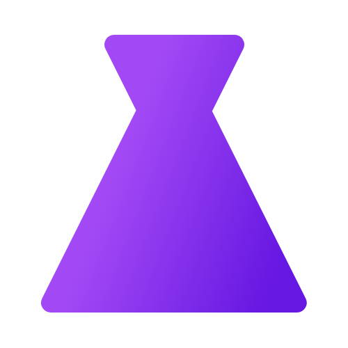

 

  

  <h1 align="center">LABS-WPF</h1>

  

    Tests and experiences on C#, .NET, and WPF.
     
    <a href="https://github.com/Leo-Corporation/LABS-WPF/releases"><strong>Download »</strong></a>
     
    <a href="https://github.com/Leo-Corporation/LABS-WPF/issues/new?assignees=&labels=bug&template=bug-report.yml&title=%5BBug%5D+">Report Bug</a>
    ·
    <a href="https://github.com/Leo-Corporation/LABS-WPF/issues/new?assignees=&labels=enhancement&template=feature-request.yml&title=%5BEnhancement%5D+">Request Feature</a>
    ·
    <a href="https://github.com/Leo-Corporation/LABS-WPF/issues?q=is%3Aopen+is%3Aissue+label%3Abug">Known Issues</a>

  

## Introduction
LABS WPF is a LABS experience on WPF.

There is mainly tests in this project, don't expect frequent release, or interesting features.

## License
Project under the [MIT](https://github.com/Leo-Corporation/LABS-WPF/blob/master/LICENSE) license.
